# Local Multimodal RAG

A fully local, multimodal Retrieval-Augmented Generation (RAG) web app. Upload PDFs,
images, and videos (or whole folders) through the browser; they are chunked, embedded,
and stored in a local **Qdrant** vector database, while the original files are kept on
disk. Chat with your knowledge base using **hybrid retrieval**, **cross-encoder
reranking**, and **grounded generation** — all on `localhost`, with no external API
calls.

Everything is organized into **Spaces** (projects): each space has its own files,
isolated vector search, saved chats, and an editable system prompt. A reusable
**prompt library** is shared across spaces.

---

## Table of contents

- [At a glance](#at-a-glance)
- [Features (user-facing)](#features-user-facing)
- [Architecture overview](#architecture-overview)
  - [System topology](#system-topology)
  - [Runtime components](#runtime-components)
  - [Ingest pipeline](#ingest-pipeline)
  - [Query & RAG pipeline](#query--rag-pipeline)
  - [Meta-question fast path](#meta-question-fast-path)
  - [Hybrid search & reranking](#hybrid-search--reranking)
  - [Context window & history](#context-window--history)
  - [Positional metadata architecture](#positional-metadata-architecture)
  - [Document statistics at ingest](#document-statistics-at-ingest)
  - [Character & punctuation counting](#character--punctuation-counting)
  - [Sources & PDF highlights](#sources--pdf-highlights)
  - [SSE streaming protocol](#sse-streaming-protocol)
  - [Frontend architecture](#frontend-architecture)
  - [Model manager & warmup](#model-manager--warmup)
- [Models & quantization](#models--quantization)
- [VRAM usage (measured)](#vram-usage-measured)
- [Project layout](#project-layout)
- [How data is stored](#how-data-is-stored)
- [How to run](#how-to-run)
- [User guide](#user-guide)
- [Chat, retrieval & sources](#chat-retrieval--sources)
- [Positional & precise queries](#positional--precise-queries)
- [API reference](#api-reference)
- [Developer guide](#developer-guide)
- [Configuration & tuning](#configuration--tuning)
- [Troubleshooting](#troubleshooting)
- [Design decisions & FAQ](#design-decisions--faq)
- [License & models](#license--models)

---

## At a glance

| | |
|---|---|
| **Stack** | FastAPI · single-page `app.html` · Qdrant · Qwen3-VL (embed / rerank / generate) |
| **Privacy** | 100% local inference; backend binds `127.0.0.1` by default |
| **Multimodal** | PDF text + embedded images · standalone images · video keyframes (~1 fps) |
| **Retrieval** | Dense vectors + keyword match → RRF merge → cross-encoder rerank |
| **Grounding** | Positional metadata per chunk · adaptive source cards · phrase + **character-level** PDF highlights |
| **GPU target** | ~6 GB VRAM with all three models in NF4 4-bit (`PRELOAD_MODELS=all`) |

**Typical flow:** create a Space → upload files (progress bar) → wait for **models
ready** → chat (streaming answer + source cards) → click a source to open the PDF with
yellow phrase highlights.

---

## Features (user-facing)

### Spaces & organization

- **Spaces** — self-contained projects with their own files, vectors, chats, and
  system prompt. Search never leaks across spaces.
- **Human-readable folders** — spaces live under `spaces/<name>__<id>/` on disk.
- **Space picker** — if you upload or chat without a space selected, the UI prompts
  you to pick or create one.

### Ingestion

- **Drag & drop or browse** — upload individual files from the Files tab or the
  welcome screen.
- **Folder upload** — ingest every supported file in a folder in one go (unsupported
  types are skipped).
- **Upload progress** — each file row shows a percentage bar while chunking,
  embedding, and saving to Qdrant (SSE from `POST /spaces/{id}/files`).
- **Multimodal** — PDFs (text + embedded page images), standalone images, and videos
  (keyframes sampled at ~1 fps).
- **Rich positional metadata** — every text chunk records document-, page-, and
  paragraph-level word ranges, region (header/body/footer), and paragraph indices (see
  [Positional metadata architecture](#positional-metadata-architecture)).
- **Delete files** — removes vectors from Qdrant **and** the stored copy on disk.

### Chat

- **Streaming answers** — responses appear token-by-token; a compact animated loader
  stays visible until the first token arrives.
- **Pipeline progress** — while loading, the assistant bubble shows live steps:
  *Embedding query → Searching content → Ranking matches → Preparing response →
  Generating response*, with a step progress bar and morphing dot animation.
- **Sources panel** — one card per chunk actually sent to the generator (no fixed
  cap). The header adapts to content type (e.g. *text passages*, *images*, or mixed).
  Each card shows precise location labels and quoted **highlight phrases** extracted
  from the answer.
- **Precise PDF highlights** — the viewer marks specific words/phrases (numbers,
  dates, answer-aligned snippets), or **every matching character** (commas, letter
  *s*, etc.) for count questions — not whole paragraphs.
- **Chat history** — prior turns are passed to the generator; older history is
  compact-summarized when the context budget fills.
- **Context ring** — a circular gauge beside the input shows how much of the ~8k token
  window is in use (retrieval + history).
- **Readable chat names** — chats are saved as `assignment-questions__c0846060.json` and
  auto-titled from the first user message.
- **Meta-question fast path** — greetings and language-capability questions (e.g.
  “can you speak Farsi?”) skip document retrieval and answer directly, avoiding
  spurious citations.

### UI

- **Dark / light theme** — indigo accent palette; toggle in the Spaces sidebar footer;
  preference saved in `localStorage`.
- **Resizable sidebars** — drag the handles between Spaces and Chats panels; widths
  persist across sessions.
- **Model load progress** — dual progress bars in the sidebar (overall + current model)
  during warmup.
- **PDF viewer** — full-screen modal with Prev/Next (cycles sources on single-page
  PDFs, pages on multi-page PDFs) and yellow phrase highlights matched to the retrieved
  chunk.
- **Model-ready gate** — Send is blocked until the sidebar shows **models ready**
  (prevents long empty bubbles while weights load).
- **Instructions tab** — per-space system prompt plus a shared preset library (save,
  load, delete presets).

### Privacy & locality

- All inference runs on your machine.
- Qdrant and file storage are local (`./qdrant_data`, `./spaces`).
- Backend binds to `127.0.0.1` by default.

---

## Architecture overview

This section is the map of the system. Each diagram shows one slice of the same
architecture — read them together for the full picture.

### System topology

High-level view: browser UI, FastAPI backend, local storage, and the three-model
inference stack.

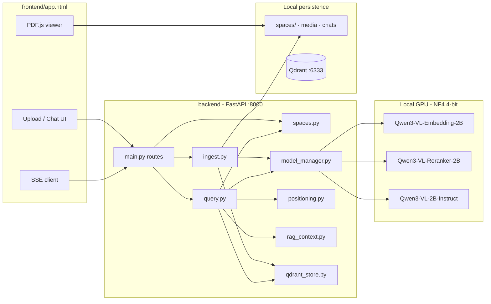

**Design principle:** Spaces are the isolation boundary. Every Qdrant point carries
`space_id`; every API call is scoped to one space. Original files never leave disk —
vectors are derived views for search.

### Runtime components

What runs when you execute `run.bat`:

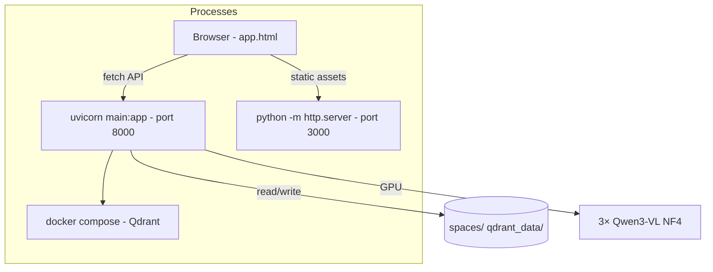

| Process | Port | Role |
|---------|------|------|
| Qdrant (Docker) | 6333 | Vector search + payload indexes |
| FastAPI / uvicorn | 8000 | REST + SSE (`/chat`, file upload stream) |
| `http.server` | 3000 | Serves `frontend/app.html` |
| Browser | — | SPA state, SSE client, PDF.js |

### Ingest pipeline

Files become searchable vectors through preprocessing, chunking, embedding, and upsert.

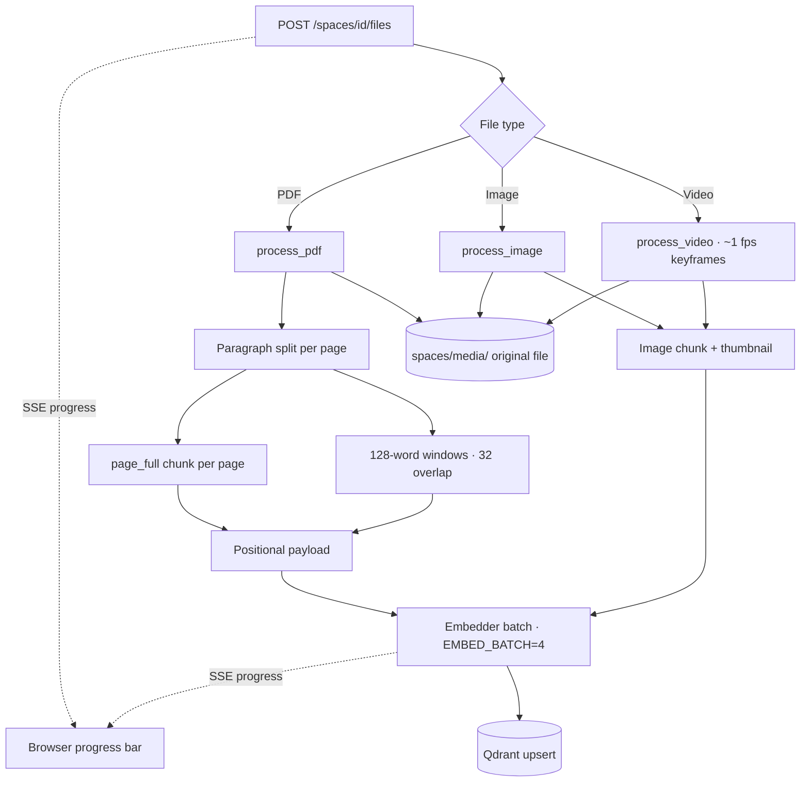

**Stages emitted over SSE during upload:**

| Stage | Typical `pct` | Meaning |
|-------|---------------|---------|
| `process` | 5–15 | Parsing PDF / extracting frames |
| `embed` | 15–93 | Batched embedding |
| `store` | 96 | Qdrant upsert |
| `complete` | 100 | Done for this file |

Key modules: [`backend/ingest.py`](backend/ingest.py),
[`backend/positioning.py`](backend/positioning.py) (`build_text_chunk_meta`),
[`backend/qdrant_store.py`](backend/qdrant_store.py) (`upsert_points`).

### Query & RAG pipeline

Document questions follow the full retrieval path. Events stream to the browser over
**Server-Sent Events (SSE)** on `POST /chat`.

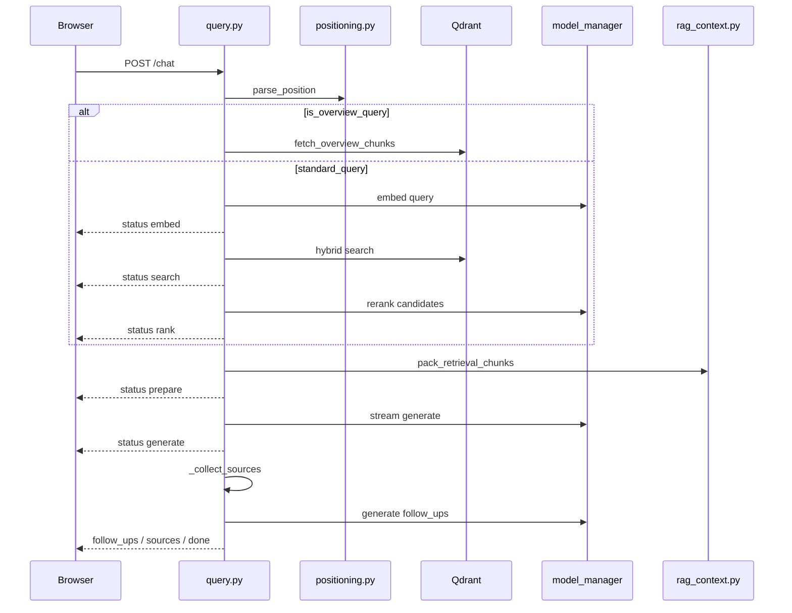

**Ordered steps inside `run_query`:**

1. **Meta check** — greetings / capability questions may bypass RAG (see below).
2. **Query Routing** — Overview bypassing (`_is_overview_query`). If true, bypasses embedding and reranking to directly fetch document structure chunks.
3. **Embed query** — Qwen3-VL-Embedding-2B (NF4), query instruction prompt.
4. **Hybrid search** — dense + keyword, merged with reciprocal rank fusion (RRF); filtered to active `space_id`; positional hints & filename constraints from `parse_position`.
5. **Positional boost / post-filter** — re-order and refine hits ([`boost_hits_by_position`](backend/positioning.py)).
6. **Rerank** — Qwen3-VL-Reranker-2B (skipped for overview queries and simple positional/count queries).
7. **Pack context** — greedy fill within token budget; dedupe overlapping chunks ([`rag_context.py`](backend/rag_context.py)).
8. **Generate** — Qwen3-VL-2B-Instruct with grounding rules + optional space system prompt + chat history.
9. **Follow-up Generation** — Generates 3 contextual follow-up questions dynamically at the end of the stream.
10. **Collect sources** — one card per packed chunk; compute `highlight_phrases`.

### Meta-question fast path

Short social or capability questions should not trigger spurious PDF citations.

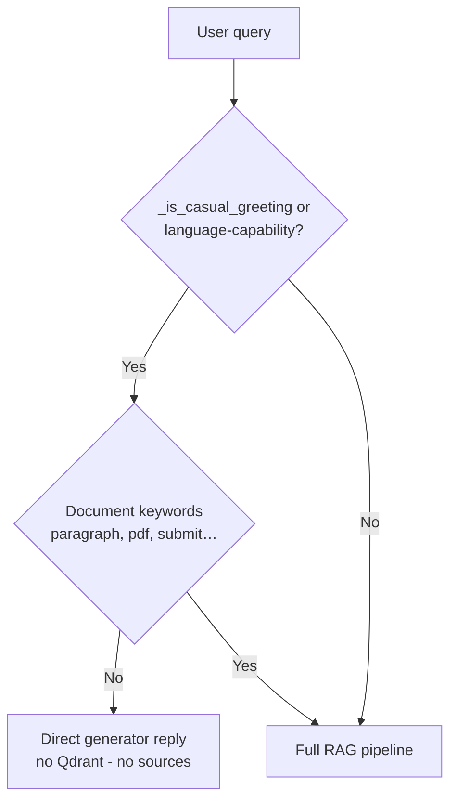

Implemented in [`backend/query.py`](backend/query.py) (`_is_casual_greeting`,
`_is_meta_capability_query`). Tested in [`backend/test_meta_query.py`](backend/test_meta_query.py).

### Hybrid search & reranking

Two retrieval signals are fused before the reranker narrows candidates.

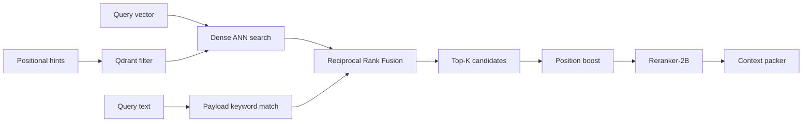

| Stage | Module | Notes |
|-------|--------|-------|
| Dense search | `qdrant_store.search` | Cosine on 2048-dim embeddings |
| Keyword search | `qdrant_store._keyword_search` | `MatchText` on chunk `text` |
| RRF merge | `qdrant_store.hybrid_search` | Combines ranked lists |
| Positional filter | `qdrant_store._positional_filter` | page, region, word ranges, paragraph indices |
| Rerank | `query.py` via reranker model | Always for overview queries |

Dynamic depth ([`query.py`](backend/query.py) `_top_k_for_space`):

| Points in space | Retrieve | Final chunks (context) |
|-----------------|----------|-------------------------|
| ≤ 12 | 24 | up to 8 (4 for overviews) |
| ≤ 30 | 30 | 8 |
| > 30 | 40 | 5 |

### Context window & history

The generator sees a fixed ~8k token budget split between history and retrieval.

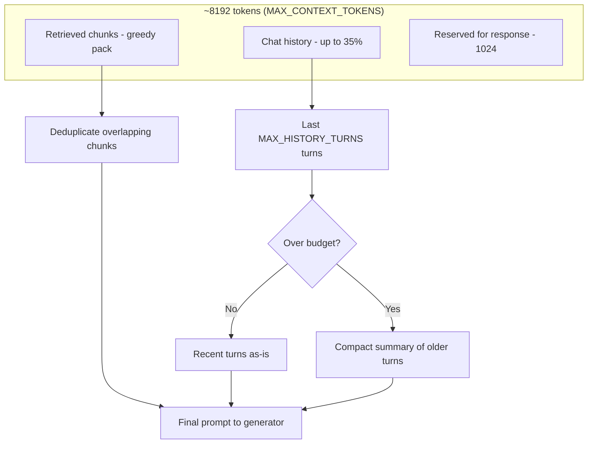

Ring UI updates via SSE `context` events (`used_tokens`, `budget_tokens`, `pct`).

### Positional metadata architecture

Each text chunk carries **three parallel coordinate systems**. Source cards label them
explicitly so page-relative and document-relative numbers are never confused.

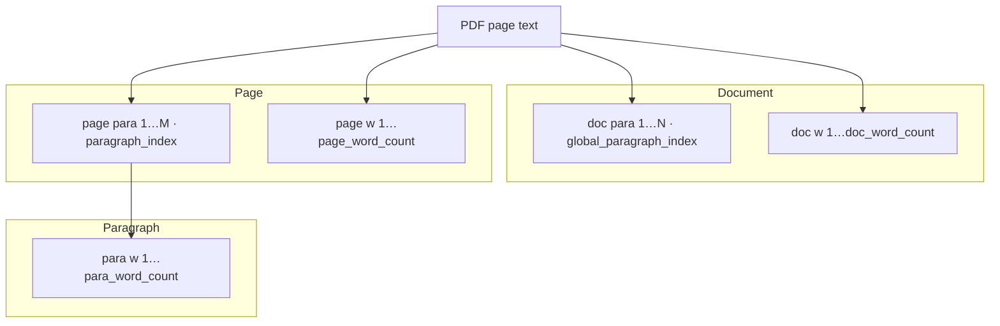

**Example source card label:**

`p.5/12 · page para 3/8 · doc para 20/156 · page w 120–124 · doc w 2695–2698 · body`

| Label | Field | Meaning |
|-------|-------|---------|
| `p.5/12` | `page`, `total_pages` | Page 5 of 12 |
| `page para 3/8` | `paragraph_index`, `paragraph_count_page` | 3rd paragraph **on this page** |
| `doc para 20/156` | `global_paragraph_index`, `paragraph_count_doc` | 20th paragraph **in the document** |
| `page w …` | `page_word_start/end` | Word range within the page |
| `doc w …` | `doc_word_start/end` | Word range within the document |
| `para w …` | `para_word_start/end` | Word range within the paragraph (when shown) |

Natural-language queries map to the right scope — see
[Positional & precise queries](#positional--precise-queries).

### Document statistics at ingest

Every PDF is analyzed **once at upload**. Counts are stored in three places so the
system never has to guess:

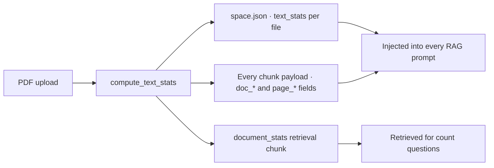

**Per document (stored on every text chunk and in `space.json`):**

| Field | Example |
|-------|---------|
| `word_count` | 8426 |
| `char_count` / `char_count_no_space` | 51234 / 48901 |
| `whitespace_count`, `line_count`, `paragraph_count` | 2333, 412, 156 |
| `comma_count`, `period_count`, … | 842, 512, … |
| `letter_a_count` … `letter_z_count` | Full alphabet frequencies |

**In every chat answer**, the generator receives a `[DOCUMENT STATISTICS — precise
counts computed at ingest]` block summarizing each file, plus per-chunk `Stats:
doc_words=…, doc_chars=…, doc_commas=…` lines on retrieved passages.

**Dedicated `document_stats` chunk** — a human-readable summary embedded and stored in
Qdrant so queries like *“how many words?”* retrieve the authoritative block directly.

> **Re-upload PDFs** after upgrading to populate `text_stats` in `space.json` and the
> new payload fields. Old vectors still work but lack full statistics until re-ingested.

Module: [`backend/document_stats.py`](backend/document_stats.py).

### Character & punctuation counting

Questions like *“how many commas in the text?”* or *“number of letter s”* bypass the
generator entirely. The backend counts characters **deterministically** from ingested
text and returns one source card per page with every match highlighted in the PDF.

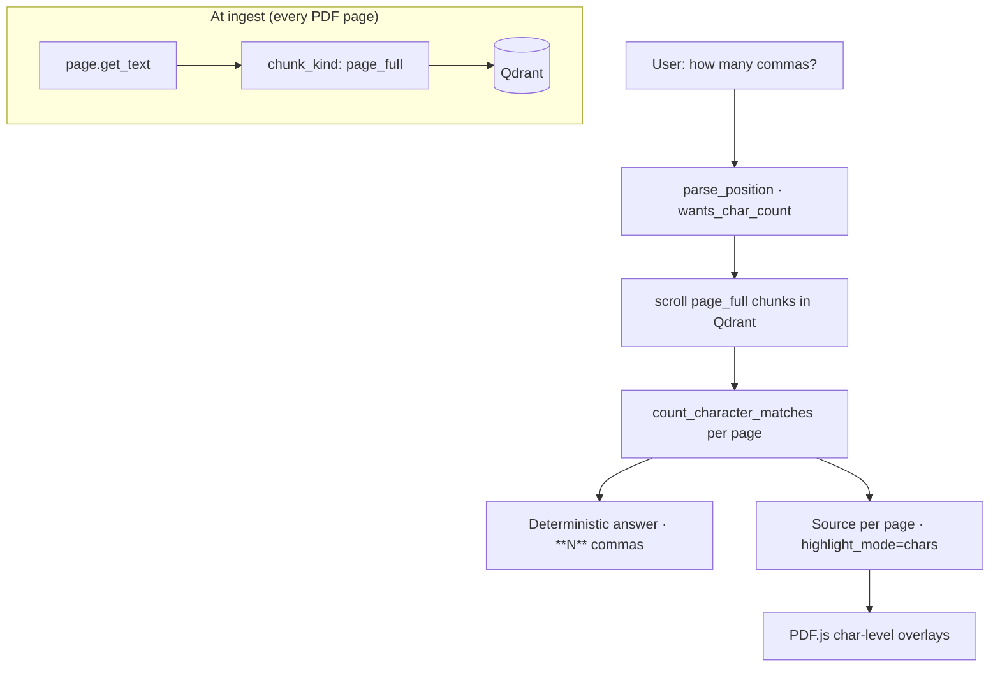

| You ask | Parsed target | Highlight mode |
|---------|---------------|----------------|
| `how many commas` / `number of commas` | `char_target = ","` | Every `,` on each page |
| `how many letter s` / `number of s letters` | `char_target = "s"`, case-insensitive | Every `s` / `S` |
| `how many periods` / `question marks` | `.` / `?` / named punctuation | Each literal character |
| `how many ","` (quoted) | Exact character | Literal match |

**Scope** (same as word-count questions): whole document (default), a specific page
(`on page 5`), or a paragraph when paragraph hints are present.

**Chunking requirement:** each PDF page is stored as a `page_full` text chunk at ingest
(in addition to paragraph/window chunks). **Re-upload PDFs** after upgrading so
multi-page documents get accurate per-page text for counting. Without `page_full`
chunks, the system falls back to deduplicated paragraph text (usually still correct,
but page boundaries are cleaner with `page_full`).

Implementation: [`positioning.py`](backend/positioning.py)
(`_parse_char_count_hints`, `build_char_count_sources`),
[`qdrant_store.py`](backend/qdrant_store.py) (`scroll_payloads`,
`get_text_chunks_for_count`), [`query.py`](backend/query.py) (deterministic branch),
[`frontend/app.html`](frontend/app.html) (`applyPdfCharHighlights`).

### Sources & PDF highlights

Most answers derive highlights **after** generation so phrase overlays align with the
answer text. **Character-count questions** are the exception: highlights are computed
from the precise count pass and mark **every** matching character on each page.

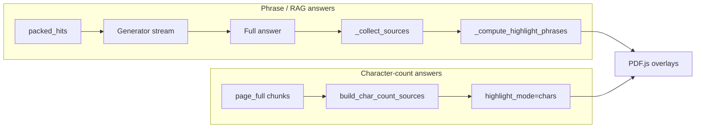

**Phrase highlight priority** (in [`query.py`](backend/query.py)):

1. Exact positional target from parsed query
2. Numbers and dates appearing in both answer and chunk
3. Short answer phrases found verbatim in the chunk
4. Query keywords present in the chunk

**Character highlights** use raw PDF text items (punctuation is **not** stripped).
Each matching character gets its own yellow overlay box via `applyPdfCharHighlights`.
Source cards show `42 × comma · all matches highlighted` and open the PDF with every
comma on that page marked.

### SSE streaming protocol

Both upload and chat use the same wire format: `data: {json}\n\n` with a leading `:`
comment to flush proxies promptly.

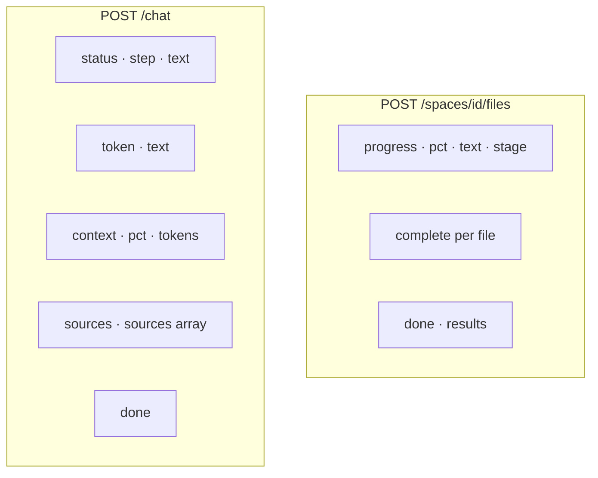

Chat pipeline steps: `embed` → `search` → `rank` → `prepare` → `generate`.

### Frontend architecture

Single-file SPA — no build step. State lives in JavaScript; the DOM is updated
imperatively.

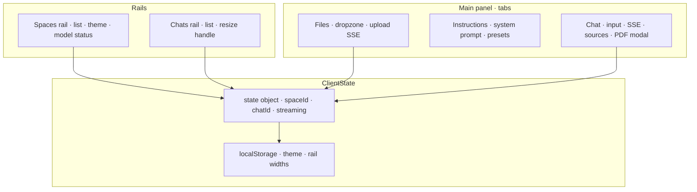

Notable UI modules in [`frontend/app.html`](frontend/app.html):

| Concern | Implementation |
|---------|----------------|
| Chat streaming | `createStreamingBubble`, SSE reader on `/chat` |
| Pipeline UX | `PIPELINE_STEPS`, progress bar, morphing dot loader |
| Upload progress | XHR + SSE parser on file upload |
| Model warmup | Poll `/models/status`, dual progress bars |
| PDF viewer | PDF.js, phrase highlight overlays, source carousel |
| Themes | CSS variables `:root` / `[data-theme=light]` indigo accent |
| Sources header | `sourcesSummarySubtitle()` — modality-aware wording |

### Model manager & warmup

Three models share one GPU through a warm-cache singleton with VRAM guards.

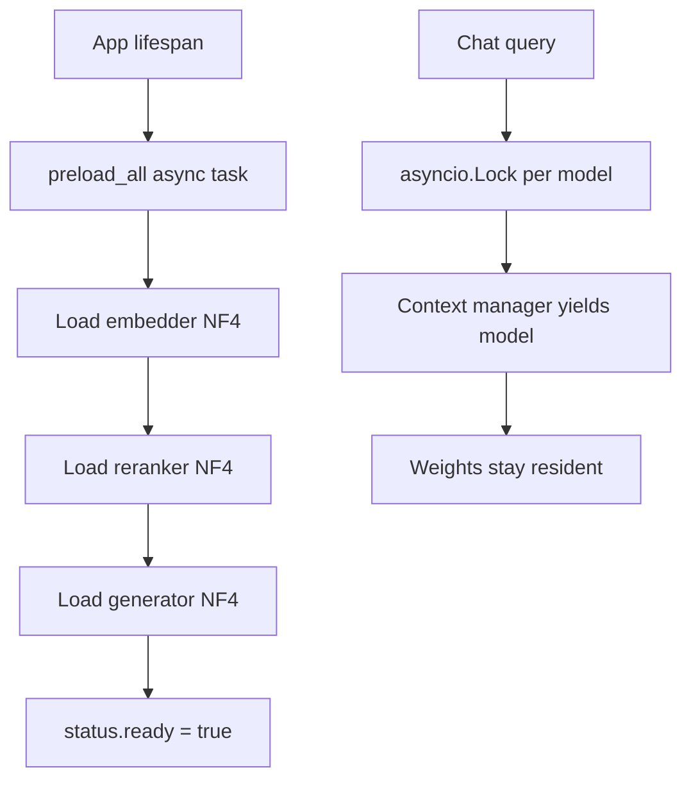

| `PRELOAD_MODELS` | Startup behaviour |
|------------------|-------------------|
| `all` (default) | Load embedder → reranker → generator sequentially |
| `embedder` | Only embedder at startup; others on first use |
| `none` | Skip warmup; models load on demand |

Status endpoint `GET /models/status` returns `{ ready, count, total, loaded,
loading, overall_pct, warmup_mode }` for the sidebar progress bars.

---

## Models & quantization

All three models are kept **warm in VRAM after first load** (no reload on later
queries). Default startup preloads **all three** (`PRELOAD_MODELS=all`).

| Role       | Model                  | Hugging Face ID               | Default precision |
|------------|------------------------|-------------------------------|-------------------|
| Embedding  | Qwen3-VL-Embedding-2B  | `Qwen/Qwen3-VL-Embedding-2B`  | NF4 (4-bit)       |
| Reranker   | Qwen3-VL-Reranker-2B   | `Qwen/Qwen3-VL-Reranker-2B`   | NF4 (4-bit)       |
| Generator  | Qwen3-VL-2B-Instruct    | `Qwen/Qwen3-VL-2B-Instruct`   | NF4 (4-bit)       |

### Quantization (NF4 4-bit) — configurable per model

Weights are loaded with `bitsandbytes` (`BitsAndBytesConfig(load_in_4bit=True)`).
Per-model precision is controlled by the `PRECISION` dict at the top of
[`backend/model_manager.py`](backend/model_manager.py):

```python
PRECISION = {
    "embedder": "4bit",   # NF4 4-bit (bitsandbytes)
    "reranker": "4bit",
    "generator": "4bit",
}
```

| Value    | Meaning                         | Requires                  |
|----------|---------------------------------|---------------------------|
| `"4bit"` | NF4 4-bit (default)             | NVIDIA GPU + bitsandbytes |
| `"8bit"` | INT8 quantization               | NVIDIA GPU + bitsandbytes |
| `"bf16"` | bfloat16                        | GPU (or CPU)              |
| `"fp16"` | float16                         | GPU                       |
| `"fp32"` | float32                         | CPU or GPU                |

Notes:

- `4bit` / `8bit` require an **NVIDIA GPU** and `bitsandbytes` (Windows supported on
  `bitsandbytes>=0.43`).
- If a 4-bit load fails on CUDA, the manager **does not** silently fall back to fp16
  (one fp16 2B model alone is ~4 GB and breaks multi-model residency on 6 GB cards).
- `PYTORCH_CUDA_ALLOC_CONF=expandable_segments:True` reduces CUDA fragmentation.
- **Turing GPUs** (GTX 16xx / RTX 20xx): prefer `4bit`; `8bit` can hang during load.

---

## VRAM usage (measured)

Figures below are from a **6 GB GPU** (e.g. GTX 1660 Ti) running all three models in
**NF4 4-bit** with `PRELOAD_MODELS=all`. Task Manager / `nvidia-smi` reports **total
GPU memory used by the system**, not just this app.

| Phase | Total GPU used | Notes |
|-------|----------------|-------|
| **Before starting the backend** | **~1.6 GB** | Windows compositor, display driver, other background GPU use |
| **After all three models loaded (idle)** | **~5.7 GB** | Steady state with embedder + reranker + generator resident |
| **Attributable to this app** | **~4.1 GB** | ≈ 5.7 − 1.6 GB delta |
| **During generation / ingest** | **~5.7–6.0 GB** | Brief activation / KV-cache spikes; stays within 6 GB in normal use |

What this means in practice:

- On a **6 GB** card you should expect **~5.7 GB total** GPU usage once models are warm,
  with **~4 GB** of that directly from the three quantized models plus CUDA runtime
  overhead.
- Leave **~0.3 GB** headroom for short spikes during PDF image embedding or long
  answers; ingest uses small embed batches (`EMBED_BATCH=4`) and downscales images to
  max 1024 px to stay safe.
- The sidebar shows **models ready** when warmup finishes; until then, chat input is
  disabled.

Component breakdown (approximate, within the ~4.1 GB app delta):

| Component | Approx. VRAM |
|-----------|----------------|
| Embedder (NF4) | ~1.2–1.4 GB |
| Reranker (NF4) | ~1.2–1.4 GB |
| Generator (NF4) | ~1.3–1.5 GB |
| CUDA context / kernels (shared) | included above |

> **Tip:** If you need VRAM back for other apps, set `PRELOAD_MODELS=embedder` so only
> the embedder loads at startup; reranker and generator load on first chat (one-time
> spike per model). See [Configuration & tuning](#configuration--tuning).

---

## Project layout

```
RAG/
├── backend/
│   ├── main.py            # FastAPI: spaces, files, chats, prompts, /chat SSE
│   ├── model_manager.py   # Warm-cache singleton, per-model precision, VRAM guards
│   ├── ingest.py          # Preprocess → chunk → embed → Qdrant upsert (SSE progress)
│   ├── query.py           # Embed → hybrid search → rerank → generate (+ meta bypass)
│   ├── qdrant_store.py    # Qdrant client, payload indexes, hybrid RRF search
│   ├── spaces.py          # Disk persistence: spaces, media files, chats
│   ├── positioning.py     # Positional metadata at ingest + NL query parsing
│   ├── rag_context.py     # Context budget, history trim/summarize, chunk packing
│   ├── prompts.py         # Reusable system-prompt library
│   ├── test_meta_query.py # Unit tests for meta-question detection
│   └── requirements.txt
├── frontend/
│   └── app.html           # Single-file SPA (Spaces · Files · Instructions · Chat)
├── models/                # Downloaded weights (gitignored)
├── spaces/                # Per-space files + chats (gitignored)
├── prompts/               # Saved prompt presets (gitignored)
├── qdrant_data/           # Qdrant volume (gitignored)
├── run.bat / stop.bat     # One-click start / stop (Windows)
├── setup_env.py           # CUDA detection + matching PyTorch install
└── docker-compose.yml     # Qdrant service
```

---

## How data is stored

### Storage architecture

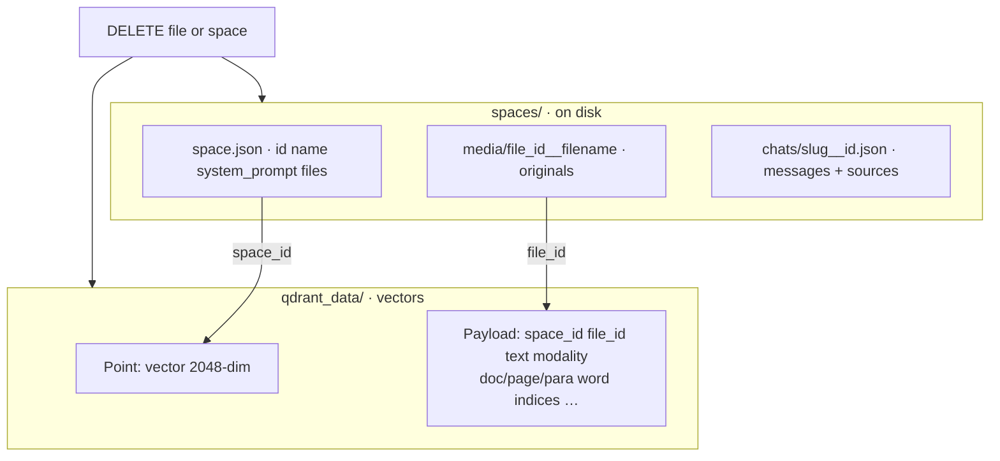

### On disk — each space

```
spaces/<folder_name>/
├── space.json                      # id, name, system_prompt, file list, timestamps
├── media/<file_id>__<filename>     # original uploads
└── chats/<slug>__<short_id>.json   # e.g. what-this-document-is-about__a1b2c3d4.json
```

Each chat JSON stores `{ id, title, messages[], created_at }`. Assistant messages
include optional `sources[]` (filename, page, positional fields, highlight phrases,
thumbnail). Each file entry in `space.json` may include **`text_stats`** — authoritative
word, character, punctuation, and letter-frequency counts computed at ingest.

Space folder names are human-readable (`test`, `my-project__a1b2c3d4`). The stable
UUID in `space.json` is what Qdrant filters on.

### In Qdrant

- Collection: `multimodal_rag`, dimension **2048**, cosine distance.
- Every point has `space_id` and `file_id` (keyword-indexed) plus rich payload fields
  for hybrid and positional search (see indexed fields in
  [`qdrant_store.ensure_collection`](backend/qdrant_store.py)).
- Deleting a file or space removes its vectors and disk files together.

### Prompt library

```
prompts/<id>.json    # { id, name, text, created_at }
```

---

## How to run

> Activate your conda environment before running any `python`, `pip`, or `hf`
> commands (for example: `conda activate p`).

### 1. Install dependencies (one time)

```powershell
conda activate p
python setup_env.py
```

The script detects CUDA via `nvidia-smi`, installs the matching PyTorch wheel, then
installs `backend/requirements.txt`. A machine with no NVIDIA GPU gets the CPU build.

<details>
<summary>Manual install</summary>

```powershell
pip uninstall -y torch torchvision torchaudio
pip install torch torchvision --index-url https://download.pytorch.org/whl/cu124
pip install -r backend/requirements.txt
python -c "import torch; print(torch.__version__, torch.cuda.is_available())"
```
</details>

### 2. Download model weights (one time, ~few GB each)

```powershell
conda activate p
hf download Qwen/Qwen3-VL-Embedding-2B --local-dir ./models/Qwen3-VL-Embedding-2B
hf download Qwen/Qwen3-VL-Reranker-2B  --local-dir ./models/Qwen3-VL-Reranker-2B
hf download Qwen/Qwen3-VL-2B-Instruct   --local-dir ./models/Qwen3-VL-2B-Instruct
```

Uses the `hf` CLI from `huggingface-hub`.

### 3. One-click launch (Windows)

```powershell
run.bat
```

Starts Qdrant (Docker), backend (`127.0.0.1:8000`), frontend (`127.0.0.1:3000`), waits
for `/health`, then opens the browser.

```powershell
stop.bat
```

`run.bat` uses `venv\Scripts\python.exe` and runs uvicorn **without `--reload`** (the
Windows file watcher can scan `venv/` and `models/` and freeze the server).

<details>
<summary>Manual start (three terminals)</summary>

**Terminal 1 — Qdrant**

```powershell
docker compose up -d
```

**Terminal 2 — Backend**

```powershell
conda activate p
uvicorn main:app --app-dir backend --host 127.0.0.1 --port 8000
```

**Terminal 3 — Frontend**

```powershell
conda activate p
python -m http.server 3000 --bind 127.0.0.1 --directory frontend
```

Open **http://127.0.0.1:3000/app.html**.
</details>

### Environment variables (paths)

| Variable | Default | Purpose |
|----------|---------|---------|
| `MODELS_DIR` | `./models` | Local model weight directories |
| `SPACES_DIR` | `./spaces` | Space folders |
| `PROMPTS_DIR` | `./prompts` | Prompt preset library |
| `QDRANT_HOST` | `localhost` | Qdrant host |
| `QDRANT_PORT` | `6333` | Qdrant port |

---

## User guide

### 1. Create or select a Space

Click **+** next to **Spaces**, enter a name, and select it. All uploads, search, and
chats are scoped to the active space.

### 2. Upload files (Files tab)

- **Browse files** or **drag & drop** onto the dropzone.
- **Select folder** to batch-ingest supported files.
- Each row shows filename, **percentage progress**, and stage text while embedding runs.
- **✕** removes a file (vectors + disk copy).

**Supported types:** `.pdf`, `.png`, `.jpg`, `.jpeg`, `.webp`, `.bmp`, `.tiff`,
`.mp4`, `.mov`, `.avi`, `.mkv`.

> **After upgrading chunking/positioning code**, re-upload PDFs so Qdrant points include
> the latest metadata (`global_paragraph_index`, `doc_w`, `page_w`, regions, etc.).

### 3. Set instructions (Instructions tab)

Write a **system prompt** for this space (tone, format, domain rules). Click **Save to
space** to apply it on every chat message in that space (appended to built-in grounding
rules in [`backend/query.py`](backend/query.py)).

Use **Save as preset** / **Load** to manage reusable prompts in the shared library.

### 4. Chat (Chat tab)

- Click **+** next to **Chats** or send a first message (a chat is created
  automatically).
- Wait for **models ready** in the sidebar (dual progress bars during load).
- Watch the **pipeline card** in the assistant bubble (step label + progress bar), then
  the **streaming answer**.
- Expand **Sources** below the answer — the subtitle reflects content types (text /
  images / mixed). Click a card to open the PDF with highlights.
- The **context ring** (beside the input) shows token budget usage.

**Theme:** toggle Dark / Light mode in the sidebar footer.

**Resize:** drag the vertical handles between Spaces and Chats panels.

### 5. PDF source viewer

- Opens from a source card.
- **Prev / Next** — on single-page PDFs with multiple sources, cycles sources; on
  multi-page PDFs, turns pages when only one source is active.
- Yellow overlays mark retrieved phrases (robust phrase matching, not tiny fragment hits).

---

## Chat, retrieval & sources

### How answers are grounded

The generator receives:

- Built-in rules (“answer only from context”, “never invent dates/deadlines/word limits”,
  cite positions).
- Optional **space system prompt** from the Instructions tab.
- **Retrieved chunks** with positional headers from `format_position_header`.
- **Chat history** (last N turns; older turns summarized if needed).
- Optional **`[PRECISE COUNT]`** or **`[EXACT WORD AT POSITION]`** prefix lines for
  count/position questions.

Generation uses `repetition_penalty=1.15` and `no_repeat_ngram_size=4` to reduce
loops (e.g. Farsi capability questions).

### Meta questions (no retrieval)

Short greetings, thanks, and language-capability questions bypass RAG entirely. Document
keywords (`paragraph`, `pdf`, `assignment`, `submit`, …) always force retrieval even in
a short question.

### Dynamic retrieval depth

See [Hybrid search & reranking](#hybrid-search--reranking) for the retrieve/final table.

Overview questions (`what this document is about`, `summarize`, …) prefer one **full-page**
chunk plus distinct paragraphs via `_select_overview_hits`.

Reranking is **always** run for overview/summary questions. It is skipped only when the
space has ≤ `SKIP_RERANK_MAX_POINTS` (default **4**) chunks **and** the query is a simple
positional or word-count question.

### Sources vs context

- **Context** — all chunks that fit in the token budget after reranking (`packed_hits`).
- **Source cards** — one per chunk in that packed context. Count is **adaptive**.
- **`highlight_phrases`** — computed after generation (see
  [Sources & PDF highlights](#sources--pdf-highlights)).
- Sources arrive **after** generation, then the stream ends.

**Sources panel header examples:**

| Retrieved content | Header |
|-------------------|--------|
| 5 text chunks only | `Sources (5) — text passages used in the answer` |
| 3 images only | `Sources (3) — images used in the answer` |
| Mixed | `Sources (4) — 3 text passages and 1 image used in the answer` |

Cards show highlight previews in the accent color; clicking opens the PDF with yellow
overlays (multiple regions per page supported).

**Note:** Old saved chats keep whatever sources were stored at the time. Send a new
message to see adaptive sources, updated positional labels, and phrase highlights.

### SSE event types (`POST /chat`)

| Event `type` | Payload | UI effect |
|--------------|---------|-----------|
| `status` | `{ step, text }` | Pipeline step + progress bar |
| `token` | `{ text }` | Append to streaming answer |
| `context` | `{ used_tokens, budget_tokens, pct, summarized }` | Context ring |
| `sources` | `{ sources: [...] }` | Source cards after answer |
| `done` | `{}` | Finalize markdown rendering |

---

## Positional & precise queries

Natural language is parsed in [`backend/positioning.py`](backend/positioning.py) and
applied as Qdrant filters, post-filters, and score boosts.

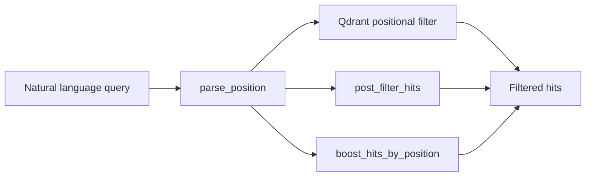

| You say | What happens |
|---------|----------------|
| `second paragraph` | `global_paragraph_index = 1` (document-wide; page-scoped if `page N` is in the query) |
| `paragraph 3 on page 5` | `paragraph_index = 2`, `page = 5` (page-relative) |
| `paragraph 20` | `global_paragraph_index = 19` (document-wide) |
| `third word in second paragraph` | `para_word_target = 3`, `global_paragraph_index = 1` |
| `first word in the submission instruction paragraph` | `para_word_target = 1`, anchor phrase match |
| `page 2` / `last page` | `page = 2` / `page_from_end = 1` |
| `50th word` / `word 50` | chunk where `doc_word_start ≤ 50 ≤ doc_word_end` |
| `3rd word on the page` | `page_word_target = 3` |
| `second-to-last word` | `word_from_end = 2` |
| `word after submission` | anchor + post-filter |
| `header` / `footer` / `title` | `region` filter |
| `first` / `last paragraph` on a page | `para_position_on_page` |
| `how many words` | precise count from ingest metadata |
| `how many commas` / `number of letter s` | deterministic char count + per-page char highlights (see [Character & punctuation counting](#character--punctuation-counting)) |

### Chunking rules

Implemented in [`backend/ingest.py`](backend/ingest.py):

- **128-word** windows, **32-word** overlap, split by PDF paragraph first.
- **`page_full` chunk** on **every PDF page** (full page text for overviews and character counts).
- **Single-page PDFs** still benefit from both `page_full` and paragraph chunks.
- PDF layout blocks infer **header / body / footer** regions via y-position.
- Tokenizer: `\S+` regex — all word counts use the same definition as positional queries.

---

## API reference

### REST endpoints

| Method | Path | Purpose |
|--------|------|---------|
| `GET` | `/health` | Liveness |
| `GET` | `/models/status` | Warmup progress `{ ready, count, total, loaded, loading, overall_pct, warmup_mode }` |
| `GET` | `/spaces` | List spaces |
| `POST` | `/spaces` | Create space `{ name }` |
| `GET` | `/spaces/{id}` | Space metadata + files + system prompt |
| `PATCH` | `/spaces/{id}` | Update name / `system_prompt` |
| `DELETE` | `/spaces/{id}` | Delete space (vectors + disk) |
| `POST` | `/spaces/{id}/files` | Upload files (multipart) — **SSE stream** |
| `DELETE` | `/spaces/{id}/files/{file_id}` | Remove file |
| `GET` | `/spaces/{id}/files/{file_id}/raw` | Download original file |
| `GET` | `/spaces/{id}/chats` | List chats |
| `POST` | `/spaces/{id}/chats` | Create chat |
| `GET` | `/spaces/{id}/chats/{chat_id}` | Get chat (messages + sources) |
| `DELETE` | `/spaces/{id}/chats/{chat_id}` | Delete chat |
| `GET` | `/prompts` | List prompt presets |
| `POST` | `/prompts` | Create preset |
| `GET` | `/prompts/{id}` | Get preset |
| `PATCH` | `/prompts/{id}` | Update preset |
| `DELETE` | `/prompts/{id}` | Delete preset |
| `POST` | `/chat` | Stream answer — body: `{ space_id, chat_id, query }` — **SSE stream** |

### SSE wire format

Both streaming endpoints return `Content-Type: text/event-stream`. Each event:

```
:
data: {"type":"token","text":"Hello"}
```

### Upload SSE events (`POST /spaces/{id}/files`)

| `type` | Fields | Meaning |
|--------|--------|---------|
| `progress` | `pct`, `text`, `stage`, optional `file` | Per-file or batch progress |
| `complete` | `chunks`, `pct`, `text` | One file finished |
| `done` | `results` | All files processed |

### Chat SSE events

See [SSE event types](#sse-event-types-post-chat) above.

### Source object shape (in `sources` event)

| Field | Description |
|-------|-------------|
| `filename`, `file_id`, `page`, `total_pages` | Location |
| `paragraph_index`, `global_paragraph_index` | Page vs document paragraph |
| `paragraph_count_page`, `paragraph_count_doc` | Denominators for labels |
| `page_word_start/end`, `word_start/end` (doc) | Word ranges |
| `para_word_start/end` | Paragraph-relative words |
| `region`, `chunk_kind`, `modality` | Layout / type |
| `highlight_phrases` | Strings to mark in PDF viewer (phrase mode) |
| `highlight_mode` | `"chars"` for character-level highlights, else phrase mode |
| `highlight_chars` | Characters to mark when `highlight_mode=chars` (e.g. `[","]`) |
| `char_case_insensitive` | Letter counts match both cases when true |
| `char_match_count` | Matches on this source's page |
| `char_target_label` | Human label (`comma`, `letter "S"`, …) |
| `thumbnail` | Base64 JPEG for image/video sources |
| `text` | Chunk text preview |

---

## Developer guide

### Module map

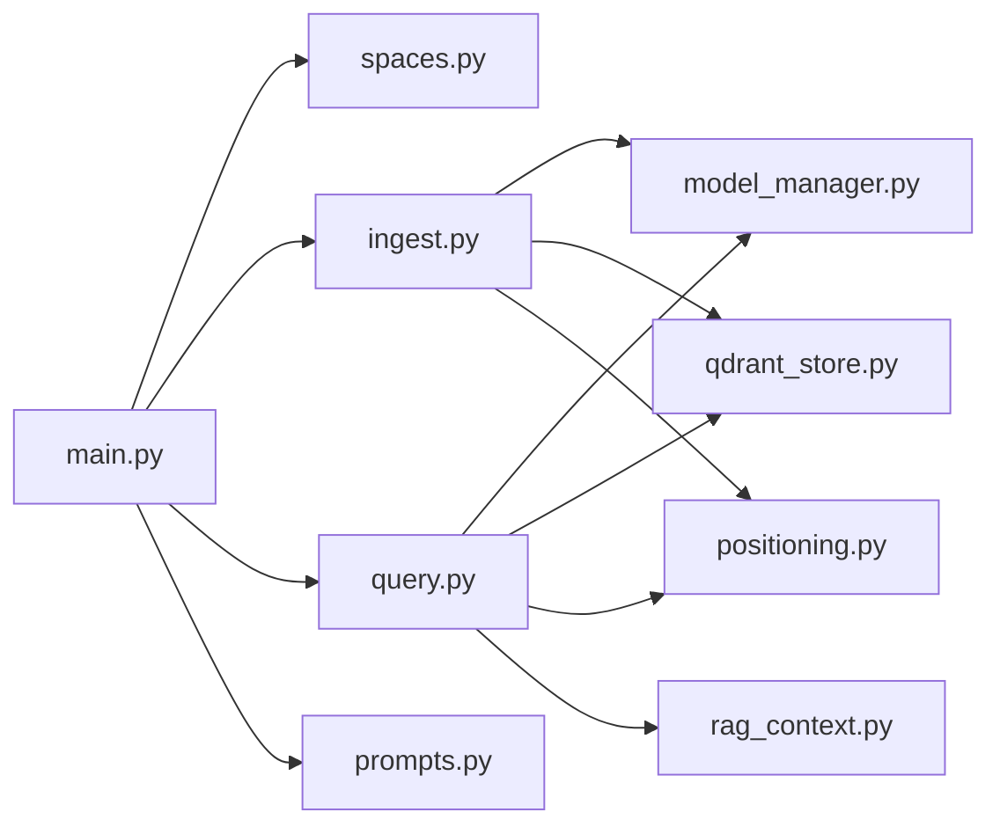

| Module | Role |
|--------|------|
| `main.py` | FastAPI routes, CORS, lifespan warmup task, SSE streaming wrapper |
| `model_manager.py` | Load/cache embedder, reranker, generator; VRAM logging; `asyncio.Lock` |
| `ingest.py` | PDF/image/video → chunks → batch embed → Qdrant upsert + SSE progress |
| `qdrant_store.py` | Collection setup, hybrid RRF search, positional filters, deletes |
| `positioning.py` | Chunk metadata builders + `parse_position()` + post-filter/boost |
| `query.py` | Full RAG pipeline, meta bypass, source collection, async token streaming |
| `rag_context.py` | Token budget, history trim/summarize, greedy chunk packing |
| `spaces.py` | CRUD for spaces/files/chats on disk; chat title migration |
| `prompts.py` | Prompt preset library CRUD |
| `frontend/app.html` | Entire UI: state, SSE client, PDF.js viewer, theme, rails |

### Adding a feature — common touchpoints

| Change | Files |
|--------|-------|
| New file type | `ingest.py` (`SUPPORTED_EXTS`, processor), `app.html` accept lists |
| New positional hint | `positioning.py` (`parse_position`, filters, `_chunk_matches_hints`) |
| Retrieval logic | `query.py`, `qdrant_store.py` |
| Generation prompt / caps | `query.py` (`GEN_KWARGS`, `MAX_NEW_TOKENS`, system prompt) |
| UI / streaming | `app.html`, `main.py` (`_sse`) |
| Persistence | `spaces.py`, `qdrant_store.py` |
| Source card labels | `query.py` (`_payload_to_source`), `app.html` (`sourceCardLabel`) |

### Context budget defaults

| Setting | Default | Env var |
|---------|---------|---------|
| Max context tokens | 8192 | `MAX_CONTEXT_TOKENS` |
| Reserved for response | 1024 | (in code) |
| Max history turns | 8 | `MAX_HISTORY_TURNS` |
| History budget share | 35% | (in code) |

### Tests

```powershell
# From the project root with environment active:
python -m pytest backend/
```

### Restart after code changes

Restart the **backend** process (stop/start `run.bat` or the uvicorn terminal). Hard
refresh the browser (`Ctrl+Shift+R`) after `app.html` changes.

---

## Configuration & tuning

| Variable | Default | Effect |
|----------|---------|--------|
| `PRELOAD_MODELS` | `all` | `all` · `embedder` · `none` — startup warmup |
| `SKIP_RERANK_MAX_POINTS` | `4` | Skip rerank only below this point count + simple queries |
| `MAX_CONTEXT_TOKENS` | `8192` | Generator context window budget |
| `MAX_HISTORY_TURNS` | `8` | Recent turns kept before summarization |
| `SINGLE_MODEL_VRAM_WARN_GB` | `2.5` | Log warning if one model exceeds this |
| `LOAD_HEADROOM_GB` | `1.8` | Min free VRAM before loading another model |
| `PRECISION` dict | all `4bit` | Per-model quantization in `model_manager.py` |

Ingest tuning in `ingest.py`: `CHUNK_SIZE=128`, `CHUNK_OVERLAP=32`, `EMBED_BATCH=4`,
`MAX_IMAGE_DIM=1024`.

Generation caps in `query.py`: `MAX_NEW_TOKENS=1024`, `SUMMARY_MAX_NEW_TOKENS=512`,
`META_MAX_NEW_TOKENS=256`.

---

## Troubleshooting

| Symptom | Likely cause | Fix |
|---------|--------------|-----|
| Sidebar stuck on “warming…” | Models still loading or OOM | Check backend terminal `[models]` logs; try `PRELOAD_MODELS=embedder` |
| `backend offline` | Uvicorn not running or port blocked | Restart backend; confirm `http://127.0.0.1:8000/health` |
| Empty / hallucinated dates | Old chunks or weak context | Re-upload PDFs; ask overview questions with rerank enabled |
| Identical source cards | Old chat history or pre-update behavior | Send a **new** question after restart |
| Positional answers wrong | Missing ingest metadata | Re-upload files after positioning upgrade |
| `para N` looks wrong on source card | Old sources missing `global_paragraph_index` | Re-ask (new sources) or re-upload PDFs |
| VRAM OOM during ingest | Image-heavy PDF spike | Reduce `EMBED_BATCH` or `MAX_IMAGE_DIM` in `ingest.py` |
| Docker error on start | Docker Desktop not running | Start Docker, then `docker compose up -d` |
| UI shows old wording / colors | Browser cache | Hard refresh `Ctrl+Shift+R` |

### Reset everything

```powershell
stop.bat
```

Then delete:

- `./qdrant_data` — all vectors
- `./spaces` — all files and chats
- `./prompts` — prompt library (optional)

---

## Design decisions & FAQ

**Why three separate models instead of one?**  
Embedding, reranking, and generation have different input formats and batch shapes.
Dedicated Qwen3-VL heads give better retrieval quality than a single model doing
everything — and NF4 quantization lets all three fit on a 6 GB card.

**Why hybrid search?**  
Dense vectors catch paraphrases; keyword match catches exact tokens (numbers, names,
rare terms). RRF merges both without calibrating a single score scale.

**Why positional metadata at ingest?**  
Word and paragraph indices are deterministic at chunk time. Storing them in the payload
enables exact filters (“50th word”, “paragraph 3 on page 5”) without re-parsing PDFs at
query time.

**Why page para vs doc para?**  
PDF line breaks create many short “paragraphs” per page. Users think in both page-local
and document-global terms — showing both prevents the confusion of mixing page-relative
paragraph numbers with document-wide word counts.

**Why sources after generation?**  
Highlight phrases for normal answers are chosen from the **actual answer text**, so PDF
overlays match what the user read — not just what was retrieved. Character-count
questions skip generation and highlight every literal match instead.

**Why page_full chunks?**  
Counting commas or letters requires the full page text without window overlap.
One `page_full` chunk per PDF page makes scroll-and-count fast and exact.

**Why SSE instead of WebSockets?**  
One-directional token streams and progress events map cleanly to SSE; no bidirectional
channel is needed. Simple to proxy and debug.

**Why a single `app.html`?**  
Zero frontend build toolchain — edit, hard-refresh, done. Fits a local research tool
where bundle size and SSR are irrelevant.

---

## License & models

Model weights are subject to the respective Hugging Face model cards (Qwen3-VL family).
This project code is local tooling; adapt licensing for your use case as needed.
