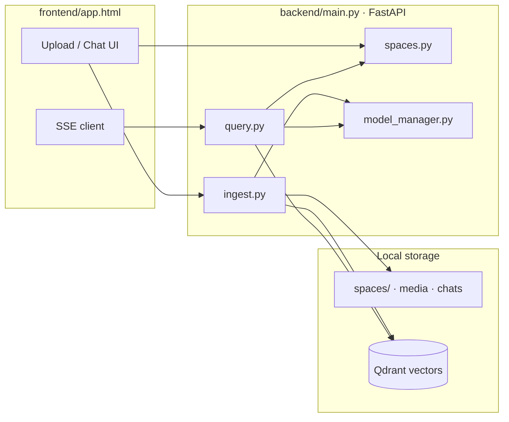

# Local Multimodal RAG

A fully local, multimodal Retrieval-Augmented Generation (RAG) web app. Upload PDFs,
images, and videos (or whole folders) through the browser; they are chunked, embedded,
and stored in a local **Qdrant** vector database, while the original files are kept on
disk. Chat with your knowledge base using **hybrid retrieval**, **cross-encoder
reranking**, and **grounded generation** — all on `localhost`, with no external API
calls.

Everything is organized into **Spaces** (projects): each space has its own files,
isolated vector search, saved chats, and an editable system prompt. A reusable
**prompt library** is shared across spaces.

---

## Table of contents

- [Features (user-facing)](#features-user-facing)
- [Architecture overview](#architecture-overview)
- [Models & quantization](#models--quantization)
- [VRAM usage (measured)](#vram-usage-measured)
- [Project layout](#project-layout)
- [How data is stored](#how-data-is-stored)
- [How to run](#how-to-run)
- [User guide](#user-guide)
- [Chat, retrieval & sources](#chat-retrieval--sources)
- [Positional & precise queries](#positional--precise-queries)
- [API reference](#api-reference)
- [Developer guide](#developer-guide)
- [Configuration & tuning](#configuration--tuning)
- [Troubleshooting](#troubleshooting)

---

## Features (user-facing)

### Spaces & organization

- **Spaces** — self-contained projects with their own files, vectors, chats, and
  system prompt. Search never leaks across spaces.
- **Human-readable folders** — spaces live under `spaces/<name>__<id>/` on disk.
- **Space picker** — if you upload or chat without a space selected, the UI prompts
  you to pick or create one.

### Ingestion

- **Drag & drop or browse** — upload individual files from the Files tab or the
  welcome screen.
- **Folder upload** — ingest every supported file in a folder in one go (unsupported
  types are skipped).
- **Multimodal** — PDFs (text + embedded page images), standalone images, and videos
  (keyframes sampled at ~1 fps).
- **Rich positional metadata** — every text chunk records document/page/paragraph word
  ranges, region (header/body/footer), and more (see
  [Positional & precise queries](#positional--precise-queries)).
- **Delete files** — removes vectors from Qdrant **and** the stored copy on disk.

### Chat

- **Streaming answers** — responses appear token-by-token with a blinking cursor.
- **Pipeline progress** — while loading, the assistant bubble shows live steps:
  *Embedding query → Searching documents → Ranking passages → Preparing response →
  Generating response*.
- **Sources panel** — one card per passage actually sent to the generator (no fixed
  cap). Each card shows location (`p.1 · para 3 · w 40–55`) and quoted
  **highlight phrases** extracted from the answer.
- **Precise PDF highlights** — the viewer marks specific words/phrases (numbers,
  dates, answer-aligned snippets), not whole paragraphs. Asking about a number
  highlights that number in the PDF.
- **Chat history** — prior turns are passed to the generator; older history is
  compact-summarized when the context budget fills.
- **Context ring** — a circular gauge beside the input shows how much of the ~8k token
  window is in use (retrieval + history).
- **Readable chat names** — chats are saved as `assignment-questions__c0846060.json` and
  auto-titled from the first user message.
- **Meta-question fast path** — greetings and language-capability questions (e.g.
  “can you speak Farsi?”) skip document retrieval and answer directly, avoiding
  spurious citations.

### UI

- **Dark / light theme** — toggle in the Spaces sidebar footer; preference saved in
  `localStorage`.
- **Resizable sidebars** — drag the handles between Spaces and Chats panels; widths
  persist across sessions.
- **PDF viewer** — full-screen modal with Prev/Next (cycles sources on single-page
  PDFs, pages on multi-page PDFs) and yellow phrase highlights matched to the retrieved
  chunk.
- **Model-ready gate** — Send is blocked until the sidebar shows **models ready**
  (prevents long empty bubbles while weights load).
- **Instructions tab** — per-space system prompt plus a shared preset library (save,
  load, delete presets).

### Privacy & locality

- All inference runs on your machine.
- Qdrant and file storage are local (`./qdrant_data`, `./spaces`).
- Backend binds to `127.0.0.1` by default.

---

## Architecture overview



**Query pipeline** (document questions):

1. **Embed query** — Qwen3-VL-Embedding-2B (NF4).
2. **Hybrid search** — dense vector search + keyword (BM25-style payload match), merged
   with reciprocal rank fusion (RRF); filtered to the active `space_id`.
3. **Positional boost / filter** — natural-language hints parsed in
   [`backend/positioning.py`](backend/positioning.py).
4. **Rerank** — Qwen3-VL-Reranker-2B (skipped only for tiny corpora + simple
   positional/count queries, never for summaries).
5. **Pack context** — greedy fill within the token budget; dedupe overlapping chunks.
6. **Generate** — Qwen3-VL-2B-Instruct with grounding rules + optional space system
   prompt + chat history.

Events stream to the browser over **Server-Sent Events (SSE)** on `POST /chat`.

---

## Models & quantization

All three models are kept **warm in VRAM after first load** (no reload on later
queries). Default startup preloads **all three** (`PRELOAD_MODELS=all`).

| Role       | Model                  | Hugging Face ID               | Default precision |
|------------|------------------------|-------------------------------|-------------------|
| Embedding  | Qwen3-VL-Embedding-2B  | `Qwen/Qwen3-VL-Embedding-2B`  | NF4 (4-bit)       |
| Reranker   | Qwen3-VL-Reranker-2B   | `Qwen/Qwen3-VL-Reranker-2B`   | NF4 (4-bit)       |
| Generator  | Qwen3-VL-2B-Instruct    | `Qwen/Qwen3-VL-2B-Instruct`   | NF4 (4-bit)       |

### Quantization (NF4 4-bit) — configurable per model

Weights are loaded with `bitsandbytes` (`BitsAndBytesConfig(load_in_4bit=True)`).
Per-model precision is controlled by the `PRECISION` dict at the top of
[`backend/model_manager.py`](backend/model_manager.py):

```python
PRECISION = {
    "embedder": "4bit",   # NF4 4-bit (bitsandbytes)
    "reranker": "4bit",
    "generator": "4bit",
}
```

| Value    | Meaning                         | Requires                  |
|----------|---------------------------------|---------------------------|
| `"4bit"` | NF4 4-bit (default)             | NVIDIA GPU + bitsandbytes |
| `"8bit"` | INT8 quantization               | NVIDIA GPU + bitsandbytes |
| `"bf16"` | bfloat16                        | GPU (or CPU)              |
| `"fp16"` | float16                         | GPU                       |
| `"fp32"` | float32                         | CPU or GPU                |

Notes:

- `4bit` / `8bit` require an **NVIDIA GPU** and `bitsandbytes` (Windows supported on
  `bitsandbytes>=0.43`).
- If a 4-bit load fails on CUDA, the manager **does not** silently fall back to fp16
  (one fp16 2B model alone is ~4 GB and breaks multi-model residency on 6 GB cards).
- `PYTORCH_CUDA_ALLOC_CONF=expandable_segments:True` reduces CUDA fragmentation.
- **Turing GPUs** (GTX 16xx / RTX 20xx): prefer `4bit`; `8bit` can hang during load.

---

## VRAM usage (measured)

Figures below are from a **6 GB GPU** (e.g. GTX 1660 Ti) running all three models in
**NF4 4-bit** with `PRELOAD_MODELS=all`. Task Manager / `nvidia-smi` reports **total
GPU memory used by the system**, not just this app.

| Phase | Total GPU used | Notes |
|-------|----------------|-------|
| **Before starting the backend** | **~1.6 GB** | Windows compositor, display driver, other background GPU use |
| **After all three models loaded (idle)** | **~5.7 GB** | Steady state with embedder + reranker + generator resident |
| **Attributable to this app** | **~4.1 GB** | ≈ 5.7 − 1.6 GB delta |
| **During generation / ingest** | **~5.7–6.0 GB** | Brief activation / KV-cache spikes; stays within 6 GB in normal use |

What this means in practice:

- On a **6 GB** card you should expect **~5.7 GB total** GPU usage once models are warm,
  with **~4 GB** of that directly from the three quantized models plus CUDA runtime
  overhead.
- Leave **~0.3 GB** headroom for short spikes during PDF image embedding or long
  answers; ingest uses small embed batches (`EMBED_BATCH=4`) and downscales images to
  max 1024 px to stay safe.
- The sidebar shows **models ready** when warmup finishes; until then, chat input is
  disabled.

Component breakdown (approximate, within the ~4.1 GB app delta):

| Component | Approx. VRAM |
|-----------|----------------|
| Embedder (NF4) | ~1.2–1.4 GB |
| Reranker (NF4) | ~1.2–1.4 GB |
| Generator (NF4) | ~1.3–1.5 GB |
| CUDA context / kernels (shared) | included above |

> **Tip:** If you need VRAM back for other apps, set `PRELOAD_MODELS=embedder` so only
> the embedder loads at startup; reranker and generator load on first chat (one-time
> spike per model). See [Configuration & tuning](#configuration--tuning).

---

## Project layout

```
RAG/
├── backend/
│   ├── main.py            # FastAPI: spaces, files, chats, prompts, /chat SSE
│   ├── model_manager.py   # Warm-cache singleton, per-model precision, VRAM guards
│   ├── ingest.py          # Preprocess → chunk → embed → Qdrant upsert
│   ├── query.py           # Embed → hybrid search → rerank → generate (+ meta bypass)
│   ├── qdrant_store.py    # Qdrant client, payload indexes, hybrid RRF search
│   ├── spaces.py          # Disk persistence: spaces, media files, chats
│   ├── positioning.py     # Positional metadata at ingest + NL query parsing
│   ├── rag_context.py     # Context budget, history trim/summarize, chunk packing
│   ├── prompts.py         # Reusable system-prompt library
│   ├── test_meta_query.py # Unit tests for meta-question detection
│   └── requirements.txt
├── frontend/
│   └── app.html           # Single-file SPA (Spaces · Files · Instructions · Chat)
├── models/                # Downloaded weights (gitignored)
├── spaces/                # Per-space files + chats (gitignored)
├── prompts/               # Saved prompt presets (gitignored)
├── qdrant_data/           # Qdrant volume (gitignored)
├── run.bat / stop.bat     # One-click start / stop (Windows)
├── setup_env.py           # CUDA detection + matching PyTorch install
└── docker-compose.yml     # Qdrant service
```

---

## How data is stored

### On disk — each space

```
spaces/<folder_name>/
├── space.json                      # id, name, system_prompt, file list, timestamps
├── media/<file_id>__<filename>     # original uploads
└── chats/<slug>__<short_id>.json   # e.g. what-this-document-is-about__a1b2c3d4.json
```

Each chat JSON stores `{ id, title, messages[], created_at }`. Assistant messages
include optional `sources[]` (filename, page, paragraph, chunk text, thumbnail).

Space folder names are human-readable (`test`, `my-project__a1b2c3d4`). The stable
UUID in `space.json` is what Qdrant filters on.

### In Qdrant

- Collection: `multimodal_rag`, dimension **2048**, cosine distance.
- Every point has `space_id` and `file_id` (keyword-indexed) plus rich payload fields
  for hybrid and positional search.
- Deleting a file or space removes its vectors and disk files together.

### Prompt library

```
prompts/<id>.json    # { id, name, text, created_at }
```

---

## How to run

> Activate your conda environment before running any `python`, `pip`, or `hf`
> commands (for example: `conda activate p`).

### 1. Install dependencies (one time)

```powershell
conda activate p
python setup_env.py
```

The script detects CUDA via `nvidia-smi`, installs the matching PyTorch wheel, then
installs `backend/requirements.txt`. A machine with no NVIDIA GPU gets the CPU build.

<details>
<summary>Manual install</summary>

```powershell
pip uninstall -y torch torchvision torchaudio
pip install torch torchvision --index-url https://download.pytorch.org/whl/cu124
pip install -r backend/requirements.txt
python -c "import torch; print(torch.__version__, torch.cuda.is_available())"
```
</details>

### 2. Download model weights (one time, ~few GB each)

```powershell
conda activate p
hf download Qwen/Qwen3-VL-Embedding-2B --local-dir ./models/Qwen3-VL-Embedding-2B
hf download Qwen/Qwen3-VL-Reranker-2B  --local-dir ./models/Qwen3-VL-Reranker-2B
hf download Qwen/Qwen3-VL-2B-Instruct   --local-dir ./models/Qwen3-VL-2B-Instruct
```

Uses the `hf` CLI from `huggingface-hub`.

### 3. One-click launch (Windows)

```powershell
run.bat
```

Starts Qdrant (Docker), backend (`127.0.0.1:8000`), frontend (`127.0.0.1:3000`), waits
for `/health`, then opens the browser.

```powershell
stop.bat
```

`run.bat` uses `venv\Scripts\python.exe` and runs uvicorn **without `--reload`** (the
Windows file watcher can scan `venv/` and `models/` and freeze the server).

<details>
<summary>Manual start (three terminals)</summary>

**Terminal 1 — Qdrant**

```powershell
docker compose up -d
```

**Terminal 2 — Backend**

```powershell
conda activate p
uvicorn main:app --app-dir backend --host 127.0.0.1 --port 8000
```

**Terminal 3 — Frontend**

```powershell
conda activate p
python -m http.server 3000 --bind 127.0.0.1 --directory frontend
```

Open **http://127.0.0.1:3000/app.html**.
</details>

### Environment variables (paths)

| Variable | Default | Purpose |
|----------|---------|---------|
| `MODELS_DIR` | `./models` | Local model weight directories |
| `SPACES_DIR` | `./spaces` | Space folders |
| `PROMPTS_DIR` | `./prompts` | Prompt preset library |
| `QDRANT_HOST` | `localhost` | Qdrant host |
| `QDRANT_PORT` | `6333` | Qdrant port |

---

## User guide

### 1. Create or select a Space

Click **+** next to **Spaces**, enter a name, and select it. All uploads, search, and
chats are scoped to the active space.

### 2. Upload files (Files tab)

- **Browse files** or **drag & drop** onto the dropzone.
- **Select folder** to batch-ingest supported files.
- Each row shows filename, chunk count, and status while embedding runs.
- **✕** removes a file (vectors + disk copy).

**Supported types:** `.pdf`, `.png`, `.jpg`, `.jpeg`, `.webp`, `.bmp`, `.tiff`,
`.mp4`, `.mov`, `.avi`, `.mkv`.

> **After upgrading chunking/positioning code**, re-upload PDFs so Qdrant points include
> the latest metadata (`doc_words`, `para_words`, regions, etc.).

### 3. Set instructions (Instructions tab)

Write a **system prompt** for this space (tone, format, domain rules). Click **Save to
space** to apply it on every chat message in that space (appended to built-in grounding
rules in [`backend/query.py`](backend/query.py)).

Use **Save as preset** / **Load** to manage reusable prompts in the shared library.

### 4. Chat (Chat tab)

- Click **+** next to **Chats** or send a first message (a chat is created
  automatically).
- Wait for **models ready** in the sidebar before sending.
- Watch the **pipeline steps** in the assistant bubble, then the **streaming answer**.
- Expand **Sources** below the answer; click a card to open the PDF with highlights.
- The **context ring** (beside the input) shows token budget usage.

**Theme:** toggle Dark / Light mode in the sidebar footer.

**Resize:** drag the vertical handles between Spaces and Chats panels.

### 5. PDF source viewer

- Opens from a source card.
- **Prev / Next** — on single-page PDFs with multiple sources, cycles sources; on
  multi-page PDFs, turns pages when only one source is active.
- Yellow overlays mark the retrieved phrase (robust phrase matching, not tiny
  fragment hits).

---

## Chat, retrieval & sources

### How answers are grounded

The generator receives:

- Built-in rules (“answer only from context”, “never invent dates/deadlines/word limits”,
  cite positions).
- Optional **space system prompt** from the Instructions tab.
- **Retrieved chunks** with positional headers.
- **Chat history** (last N turns; older turns summarized if needed).
- Optional **`[PRECISE COUNT]`** or **`[EXACT WORD AT POSITION]`** prefix lines for
  count/position questions.

Generation uses `repetition_penalty=1.15` and `no_repeat_ngram_size=4` to reduce
loops (e.g. Farsi capability questions).

### Meta questions (no retrieval)

Short greetings, thanks, and language-capability questions bypass RAG entirely. Document
keywords (`paragraph`, `pdf`, `assignment`, `submit`, …) always force retrieval even in
a short question.

### Dynamic retrieval depth

[`backend/query.py`](backend/query.py) adjusts `retrieve_k` and `final_k` by corpus size:

| Points in space | Retrieve | Final chunks (context) |
|-----------------|----------|-------------------------|
| ≤ 12            | 24       | up to 8 (4 for overviews) |
| ≤ 30            | 30       | 8 |
| > 30            | 40       | 5 |

Overview questions (`what this document is about`, `summarize`, …) prefer one **full-page**
chunk plus distinct paragraphs via `_select_overview_hits`.

Reranking is **always** run for overview/summary questions. It is skipped only when the
space has ≤ `SKIP_RERANK_MAX_POINTS` (default **4**) chunks **and** the query is a simple
positional or word-count question.

### Sources vs context

- **Context** — all chunks that fit in the token budget after reranking (`packed_hits`).
- **Source cards** — one per chunk in that packed context (each distinct retrieval
  window/paragraph that contributed). Count is **adaptive**: a large doc with many
  relevant sections can show many cards; a precise question may show fewer chunks but
  each with tight highlights.
- **`highlight_phrases`** — computed after the answer is generated by aligning the
  response with each source chunk:
  - Exact words/numbers from positional queries
  - Numbers and dates appearing in both answer and source
  - Short phrases from the answer found verbatim in the chunk
  - Query keywords present in the chunk
- Sources arrive **after** generation (with highlights), then the stream ends.

Cards show a preview of highlight phrases in green; clicking opens the PDF with those
spans marked in yellow (multiple regions per page supported).

**Note:** Old saved chats keep whatever sources were stored at the time. Send a new
message to see adaptive sources and phrase highlights.

### SSE event types (`POST /chat`)

| Event `type` | Payload | UI effect |
|--------------|---------|-----------|
| `status` | `{ step, text }` | Pipeline step indicator |
| `token` | `{ text }` | Append to streaming answer |
| `context` | `{ used_tokens, budget_tokens, pct, summarized }` | Context ring |
| `sources` | `{ sources: [...] }` | Source cards after answer |
| `done` | `{}` | Finalize markdown rendering |

Steps: `embed` → `search` → `rank` → `prepare` → `generate`.

---

## Positional & precise queries

Natural language is parsed in [`backend/positioning.py`](backend/positioning.py) and
applied as Qdrant filters, post-filters, and score boosts.

| You say | What happens |
|---------|----------------|
| `second paragraph` | `paragraph_index = 1` |
| `third word in second paragraph` | `para_word_target = 3`, `paragraph_index = 1` |
| `first word in the submission instruction paragraph` | `para_word_target = 1`, anchor phrase match |
| `page 2` / `last page` | `page = 2` / `page_from_end = 1` |
| `50th word` / `word 50` | chunk where `doc_word_start ≤ 50 ≤ doc_word_end` |
| `3rd word on the page` | `page_word_target = 3` |
| `second-to-last word` | `word_from_end = 2` |
| `word after submission` | anchor + post-filter |
| `header` / `footer` / `title` | `region` filter |
| `first` / `last paragraph` | `para_position_on_page` |
| `how many words` | precise count from ingest metadata |

Chunking ([`backend/ingest.py`](backend/ingest.py)):

- **128-word** windows, **32-word** overlap, split by PDF paragraph first.
- **Single-page PDFs** also get a **`page_full`** chunk for broad questions.
- PDF layout blocks infer **header / body / footer** regions.

---

## API reference

| Method | Path | Purpose |
|--------|------|---------|
| `GET` | `/health` | Liveness |
| `GET` | `/models/status` | Warmup progress `{ ready, count, total, loaded, warmup_mode }` |
| `GET` | `/spaces` | List spaces |
| `POST` | `/spaces` | Create space `{ name }` |
| `GET` | `/spaces/{id}` | Space metadata + files + system prompt |
| `PATCH` | `/spaces/{id}` | Update name / `system_prompt` |
| `DELETE` | `/spaces/{id}` | Delete space (vectors + disk) |
| `POST` | `/spaces/{id}/files` | Upload files (multipart) |
| `DELETE` | `/spaces/{id}/files/{file_id}` | Remove file |
| `GET` | `/spaces/{id}/files/{file_id}/raw` | Download original file |
| `GET` | `/spaces/{id}/chats` | List chats |
| `POST` | `/spaces/{id}/chats` | Create chat |
| `GET` | `/spaces/{id}/chats/{chat_id}` | Get chat (messages + sources) |
| `DELETE` | `/spaces/{id}/chats/{chat_id}` | Delete chat |
| `GET` | `/prompts` | List prompt presets |
| `POST` | `/prompts` | Create preset |
| `GET` | `/prompts/{id}` | Get preset |
| `PATCH` | `/prompts/{id}` | Update preset |
| `DELETE` | `/prompts/{id}` | Delete preset |
| `POST` | `/chat` | Stream answer — body: `{ space_id, chat_id, query }` |

Chat responses use `Content-Type: text/event-stream`. Each event is `data: {json}\n\n`.

---

## Developer guide

### Module responsibilities

| Module | Role |
|--------|------|
| `main.py` | FastAPI routes, CORS, lifespan warmup task, SSE streaming wrapper |
| `model_manager.py` | Load/cache embedder, reranker, generator; VRAM logging; `asyncio.Lock` |
| `ingest.py` | PDF/image/video → chunks → batch embed → Qdrant upsert |
| `qdrant_store.py` | Collection setup, hybrid RRF search, positional filters, deletes |
| `positioning.py` | Chunk metadata builders + `parse_position()` + post-filter/boost |
| `query.py` | Full RAG pipeline, meta bypass, source collection, async token streaming |
| `rag_context.py` | Token budget, history trim/summarize, greedy chunk packing |
| `spaces.py` | CRUD for spaces/files/chats on disk; chat title migration |
| `prompts.py` | Prompt preset library CRUD |
| `frontend/app.html` | Entire UI: state, SSE client, PDF.js viewer, theme, rails |

### Adding a feature — common touchpoints

| Change | Files |
|--------|-------|
| New file type | `ingest.py` (`SUPPORTED_EXTS`, processor), `app.html` accept lists |
| New positional hint | `positioning.py` (`parse_position`, filters, `_chunk_matches_hints`) |
| Retrieval logic | `query.py`, `qdrant_store.py` |
| Generation prompt / caps | `query.py` (`GEN_KWARGS`, `MAX_NEW_TOKENS`, system prompt) |
| UI / streaming | `app.html`, `main.py` (`_sse`) |
| Persistence | `spaces.py`, `qdrant_store.py` |

### Context budget defaults

| Setting | Default | Env var |
|---------|---------|---------|
| Max context tokens | 8192 | `MAX_CONTEXT_TOKENS` |
| Reserved for response | 1024 | (in code) |
| Max history turns | 8 | `MAX_HISTORY_TURNS` |
| History budget share | 35% | (in code) |

### Tests

```powershell
conda activate p
cd backend
python -m pytest test_meta_query.py -q
```

### Restart after code changes

Restart the **backend** process (stop/start `run.bat` or the uvicorn terminal). Hard
refresh the browser (`Ctrl+Shift+R`) after `app.html` changes.

---

## Configuration & tuning

| Variable | Default | Effect |
|----------|---------|--------|
| `PRELOAD_MODELS` | `all` | `all` · `embedder` · `none` — startup warmup |
| `SKIP_RERANK_MAX_POINTS` | `4` | Skip rerank only below this point count + simple queries |
| `MAX_CONTEXT_TOKENS` | `8192` | Generator context window budget |
| `MAX_HISTORY_TURNS` | `8` | Recent turns kept before summarization |
| `SINGLE_MODEL_VRAM_WARN_GB` | `2.5` | Log warning if one model exceeds this |
| `LOAD_HEADROOM_GB` | `1.8` | Min free VRAM before loading another model |
| `PRECISION` dict | all `4bit` | Per-model quantization in `model_manager.py` |

Ingest tuning in `ingest.py`: `CHUNK_SIZE=128`, `CHUNK_OVERLAP=32`, `EMBED_BATCH=4`,
`MAX_IMAGE_DIM=1024`.

Generation caps in `query.py`: `MAX_NEW_TOKENS=1024`, `SUMMARY_MAX_NEW_TOKENS=512`,
`META_MAX_NEW_TOKENS=256`.

---

## Troubleshooting

| Symptom | Likely cause | Fix |
|---------|--------------|-----|
| Sidebar stuck on “warming…” | Models still loading or OOM | Check backend terminal `[models]` logs; try `PRELOAD_MODELS=embedder` |
| `backend offline` | Uvicorn not running or port blocked | Restart backend; confirm `http://127.0.0.1:8000/health` |
| Empty / hallucinated dates | Old chunks or weak context | Re-upload PDFs; ask overview questions with rerank enabled |
| Five identical source cards | Old chat history or pre-update behavior | Send a **new** question after restart |
| Positional answers wrong | Missing ingest metadata | Re-upload files after positioning upgrade |
| VRAM OOM during ingest | Image-heavy PDF spike | Reduce `EMBED_BATCH` or `MAX_IMAGE_DIM` in `ingest.py` |
| Docker error on start | Docker Desktop not running | Start Docker, then `docker compose up -d` |

### Reset everything

```powershell
stop.bat
```

Then delete:

- `./qdrant_data` — all vectors
- `./spaces` — all files and chats
- `./prompts` — prompt library (optional)

---

## License & models

Model weights are subject to the respective Hugging Face model cards (Qwen3-VL family).
This project code is local tooling; adapt licensing for your use case as needed.
